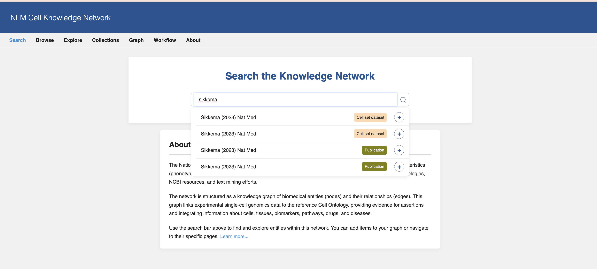
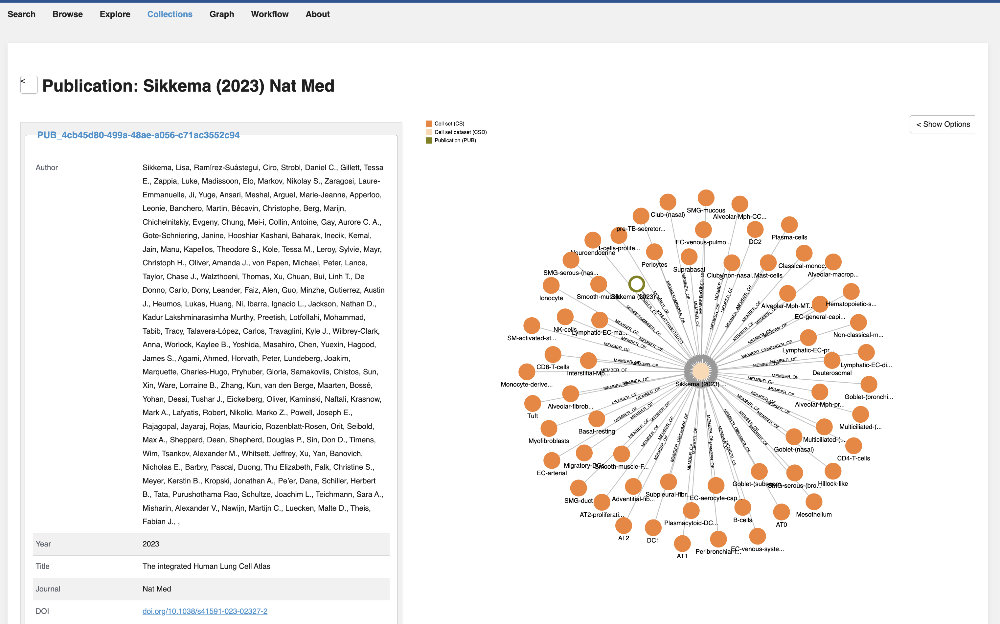
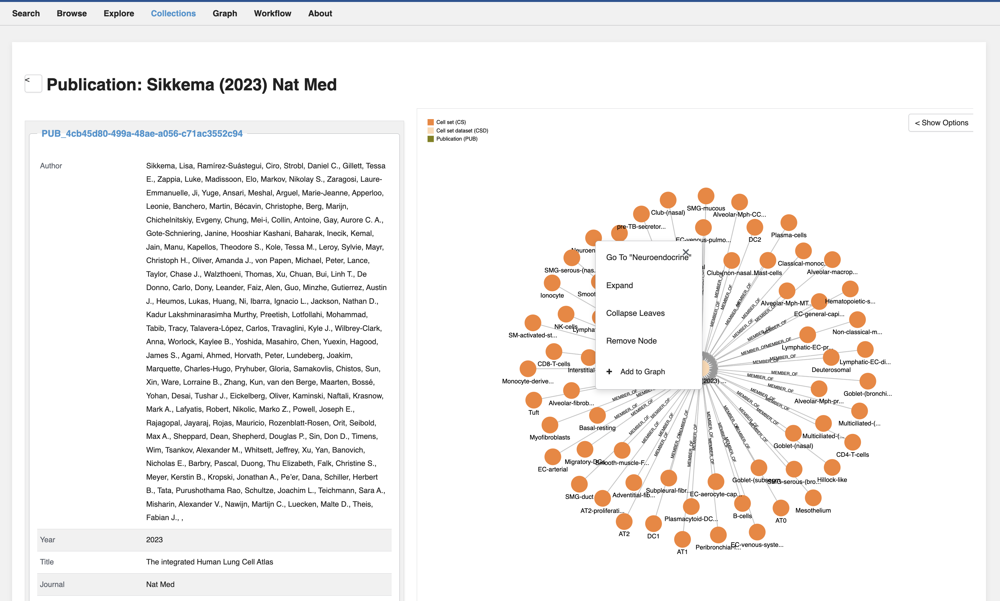
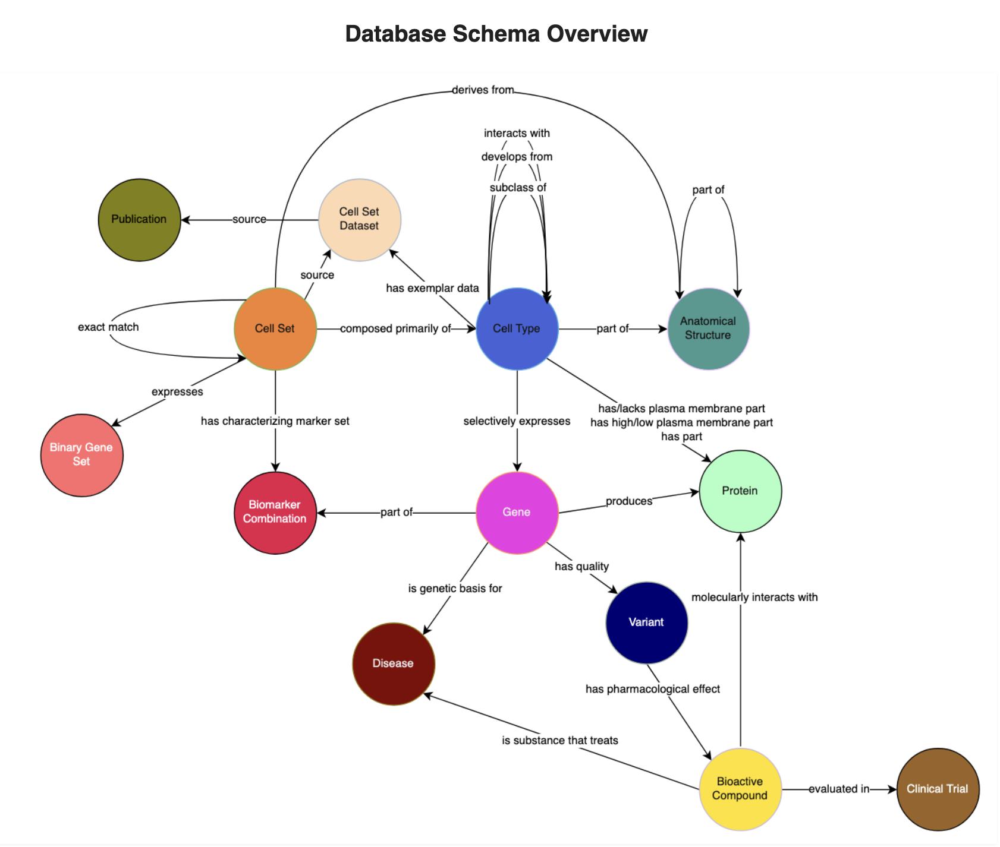

# NLM Cell Knowledge (NLM-CKN) Network

The __National Library of Medicine (NLM) Cell Knowledge Network (**NLM-CKN**)__ is a knowledgebase focused on cell characteristics (phenotypes) derived from single-cell technologies. It integrates this information with data from reference ontologies, NCBI resources, and text mining efforts.

The network is structured as a knowledge graph of biomedical entities (nodes) and their relationships (edges). This graph links experimental single-cell genomics data to the reference Cell Ontology, providing evidence for assertions and integrating information about cells, tissues, biomarkers, pathways, drugs, and diseases.

Use the search bar above to find and explore entities within this network. You can add items to your graph or navigate to their specific pages.

**Production Data**
A knowledge graph is produced from triple assertions (subject-predicate-object) corresponding to biomedical entities (nodes) and their relations (edges), and links experimental data to the reference Cell Ontology as evidence in support of assertions. The graph integrates single cell genomics experimental data with other information sources about cells, tissues, biomarkers, pathways, drugs, diseases.

This application creates a knowledge network encapsulating the latest knowledge on cells, the evidence primarily coming from single cell genomics experiments, including but not limited single nucleus as well as single cell RNA-sequencing experiments, spatial transcriptomics experiments.  The majority of these data and those stored within many data repositories, notably the Chan-Zuckerburg [CELLxGENE](https://cellxgene.cziscience.com/).  Many of these data form the foundations for numerous cell atlases.

The NLM-CKN aims to connect these experimental data augmented with characterizing marker genes computationally derived from the [NS-Forest](https://github.com/JCVenterInstitute/NSForest/tree/master) machine learning method, which identifies the necessary and sufficient marker genes that define the data-driven cell type cluster, resolved to a cell ontological type using semantic terms updated and maintained at the [Cell Ontology](https://www.ebi.ac.uk/ols4/ontologies/cl).

__*This resource is under active development. To contribute, please open an [issue](https://github.com/NIH-NLM/cell-kn/issues) on this Github repository.*__

## NLM-CKN Infrastructure Architecture

## Repositories of Interest

* [NLM-CKN Schema](https://github.com/NIH-NLM/cell-kn-schema#README)
  
* [NLM-CKN CellxGene Harvester](https://github.com/NIH-NLM/cellxgene-harvester#cellxgene-harvester)
  This package is used to select cellxgene scRNA-seq and snRNA-seq datasets from cellxgene. Using the cellxgene harvester and obtaining ontologies from the [Ontology Lookup Service]{https://www.ebi.ac.uk/ols4/} 
    * Full API and CLI documentation auto-generated with Sphinx and deployed via GitHub Pages: https://nih-nlm.github.io/cellxgene-harvester/documentation 

* [NLM-CKN scsilhouette Python Package](https://github.com/NIH-NLM/scsilhouette#scsilhouette)
  This package is part of the quality control workflow and together with the NSForest F-scores provides an overview of the single cell clusters used in the knowledgebase.
    * Full CLI documentation auto-generated with Sphinx and deployed via GitHub Pages: [https://nih-nlm.github.io/scsilhouette/](https://nih-nlm.github.io/scsilhouette/)
    * Docker image built and container released with every push via GitHub's container repository [https://github.com/NIH-NLM/scsilhouette/pkgs/container/scsilhouette](https://github.com/NIH-NLM/scsilhouette/pkgs/container/scsilhouette)

* [NLM-CKN sc-nsforest-qc-nf with CLI wrapper to JCVI's NSForest package](https://github.com/NIH-NLM/sc-nsforest-qc-nf#sc-nsforest-qc-nf)
  This [Nextflow](https://nextflow.io) workflow runs the scsilhouette python package via the released container and NSForest via the CLI generating > 50 Artefacts and data for the [NLM-CKN](https://cell-kn.org/).
    * Full CLI documentation autogenerated via a python script in the Sphinx style and deployed via GitHub pages [https://nih-nlm.github.io/sc-nsforest-qc-nf/](https://nih-nlm.github.io/sc-nsforest-qc-nf/)
    * Notable is the generation of the combined silhouette bar and whisker plot together with the F-Score bar chart, summarizing the quality assessment for the clusters (cell sets) and cell set data set.
    * Production data and visualizations are published to this repository and are viewable via this repository's GitHub Pages.  This includes all the datasets for each tissue that are:
        * loaded into the [NLM-CKN](https://cell-kn.org/)
        * additional visualizations for all datasets for each tissue visible here [https://nih-nlm.github.io/nlm-ckn/](https://nih-nlm.github.io/nlm-ckn/)
        * or you can find the production data directly on GitHub here: [https://github.com/NIH-NLM/cell-kn/tree/main/data/prod](https://github.com/NIH-NLM/cell-kn/tree/main/data/prod)

* [NLM-CKN Extract Transform Load Ontologies](https://github.com/NIH-NLM/cell-kn-mvp-etl-ontologies#README)

* [NLM-CKN Extract Transform Load Results](https://github.com/NIH-NLM/cell-kn-mvp-etl-results#README)

* [NLM-CKN User Interface](https://github.com/NIH-NLM/cell-kn-mvp-ui#README)

## Navigating NLM-CKN 

### Search Landing Page - Best place to Search!

Here you can enter any term, gene, protein, publication, anatomical subunit, etc.
Here you see when you enter `Sikkema`

### Select a result

You can select the `Sikkema publication`

Selecting the publication brings you to a graph that has the all the Cell Sets for this publication. A publication Cell Set Dataset contains all the Cell sets.

You can select one of the cell sets, say neuroendrocrine cell set dataset

### Cell set Detail

The neuroendrocrine cell set reveals the NS-Forest necessary and sufficient markers (biomarker combination) and the binary genes for this cell set.  This is the quantitative result with a F-Beta score (0.937) showing that there is strong evidence in this experimental cell set dataset for these markers to be able to distinctly identify this cell type.

### The NLM Cell Schema

You can see the relationships held in the graph by looking at the static schema.  

